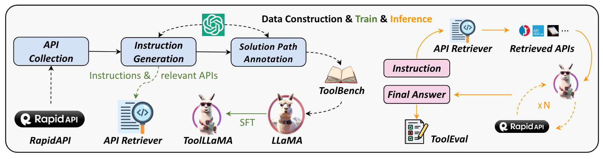
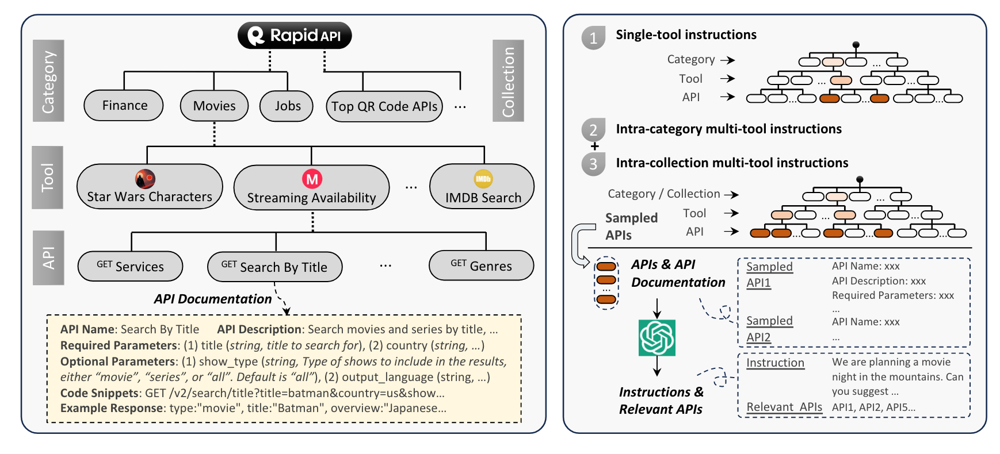

# ToolLLM: Facilitating Large Language Models to Master 16000+ Real-world APIs
[Paper link](https://arxiv.org/abs/2307.16789)
[ToolBench](https://openbmb.github.io/ToolBench/)

## Abstract
本文介绍了 ToolLLM, 这是一个用于训练大型语言模型 (LLM) 以有效使用工具和应用程序接口的通用框架. 尽管像 LLaMA 这样的开源 LLM 已经通过指令调整实现了强大的语言能力, 但它们在执行需要与外部工具和 API 交互的更高级任务方面仍然缺乏复杂性. 这与 ChatGPT 等闭源 LLM 形成了鲜明对比, 后者展示了出色的工具使用能力.

## Dataset Construction
ToolBench 是一个用于构建 ToolLLM 的训练数据集, 该数据集包含超过 16,000 个真实世界的 REST API，涵盖 49 个类别, 以及在单工具和多工具场景中使用这些 API 的各种人工指令.

||
|:--:|
|*ToolLLM Overview*|

### API Collection
API 的收集主要涵盖以下三个步骤:

1. 收集每个 API 的详细信息，包括描述、参数和代码片段.
2. 过滤掉不返回结果或响应时间长的 API.
3. 使用 ChatGPT 压缩冗长的 API 响应，保留重要信息

||
|:--:|
|*RapidAPI 有天然的层级关系, 利用这层关系可以更好的结合不同的工具*|

### Instruction Generation

