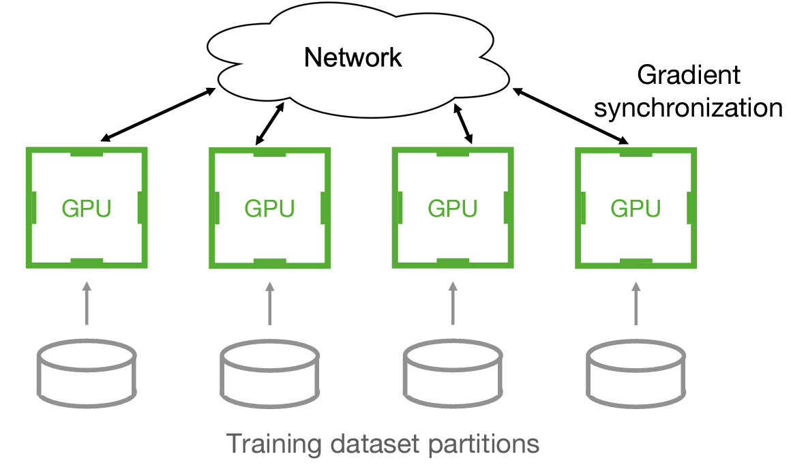
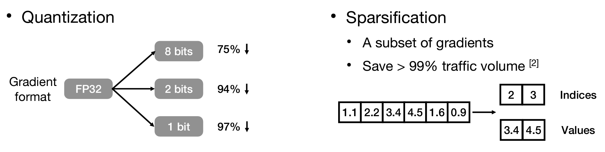
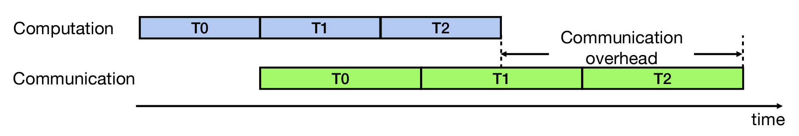
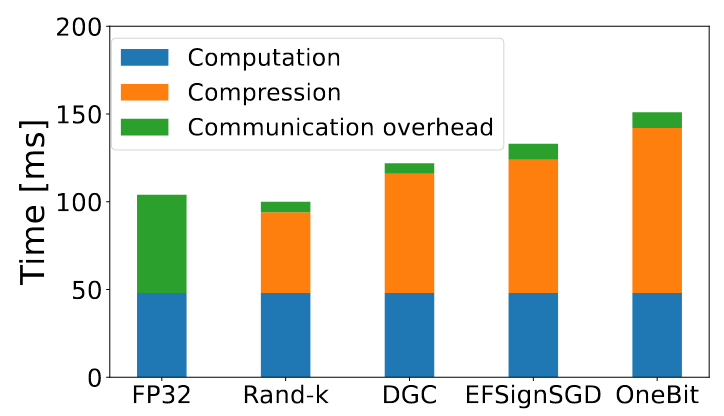
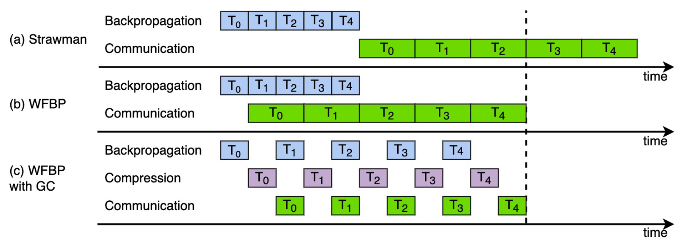
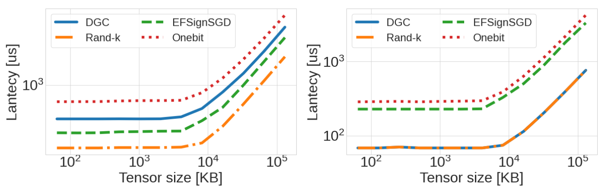
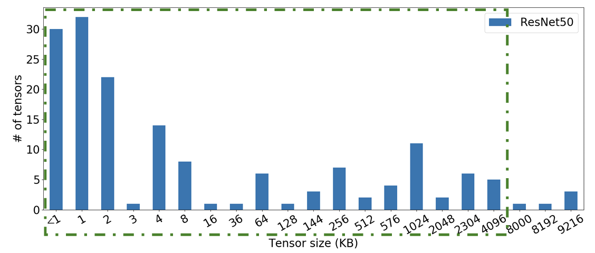

# Cupcake: A Compression Scheduler for Scalable Communication-Efficient Distributed Training
[Paper link](https://proceedings.mlsys.org/paper_files/paper/2023/hash/f67b34cb0f0d24b6226178aa6a649cc4-Abstract-mlsys2023.html)

## Abstract

数据并行分布式训练 (DDP) 中, 梯度同步的通信 (All-reduce) 成为主要的效率瓶颈. 许多工作提出梯度压缩 (Gradient Compression) 来减少通信数据量, 从而解决这个瓶颈. 不过, 很多梯度压缩算法只有在 DDP 中取得了微小的性能提升, 甚至有些算法反而损害了性能. 问题的关键在于, 使用传统的 Layerwise 梯度传输方法, 压缩梯度存在额外开销. 

*Data Parallel Training*

作者提出了Cupcake这一通用的压缩优化器, 其核心思想是将多个 Gradient Tensor 融合后一起进行压缩, 而不是对每个 Gradient Tensor 分别压缩. 与传统 DDP 相比, 带梯度压缩的 DDP + Fusion 可以实现高达 2.03 倍的训练吞吐量提升.

*Gradient Compression 可以降低通信量*

## Background
### Distributed Data Parallelism 中存在的问题

DDP 训练中存在以下问题:
1. **通信与计算不平衡.** GPU 计算能力的快速提升导致单个 GPU 的迭代计算时间大幅下降, 而网络带宽的提升速度跟不上计算能力的提升速度, 导致计算和通信之间的不平衡.
2. **梯度同步的通信是主要的效率瓶颈.** 随着参与训练的 GPU 数量增加,需要同步的梯度数据量也线性增长, 导致梯度同步的通信时间占用训练时间的很大一部分.

*Overhead 来自于 DDP 的计算与通信无法全部重叠, 即使用上了 WFBP*
3. **全精度(32位浮点数)的梯度通信带来大量的通信时间.**

### Gradient Compression 中存在的问题

为了缓解 DDP 训练中的通信瓶颈, 通过梯度稀疏化或量化可以大幅降低同步的流量, 减少通信时间. 但是, 由于梯度稀疏化和量化的计算开销, 实际的训练速度并没有得到提升.

*在 ResNet50 上, 几个梯度压缩算法的效果甚至还不如原来的 DDP*

问题的原因主要出现在两个方面.

首先, 压缩开销可能超过通信时间减少的量. 论文通过 ResNet50 上的案例分析显示, 即使极大地减少了通信量, 但总的压缩开销仍可能大于不压缩情况下的通信开销. 压缩操作与反向传播竞争GPU资源, 大大增加了张量的计算时间. 额外的压缩操作还改变了通信和计算的重叠情况, 难以发挥并行处理的优势.

*图 (c) 中梯度压缩的时间不能被忽略, 而且压缩算法需要额外的编码和解码运算, 还会占用 GPU 的计算资源*

其次, 梯度压缩的开销还出在压缩算法的 CUDA Kernel Launch Time, 对于小的 Gradient Tensor, 这个开销可能会占据大部分的时间. 以论文中测试的环境为例, 当 Tensor 大小小于 4MB 时, 压缩的编码和解码延迟保持常数不变. 当 Tensor 大小超过 4MB 时, 压缩延迟才会随着 Tensor 大小线性增加.

*左图为梯度 Encode 所需的时间, 右图为梯度 Decode 所需的时间*

*ResNet50 中, 大部分 Tensor 的大小都不足 4MB*

还是论文中的测试环境, 对于 128KB 的 Tensor, DGC 算法的编码延迟在 0.4ms 左右. 如果有 10 个这样大小的 Tensor, 按层次压缩需要进行 10 次独立的编码操作,总编码延迟为 10 * 0.4ms = 4ms.

但是如果将这 10 个 128KB 的 Tensor 融合后一起编码, 由于固定开销的存在, 总的编码延迟还是 0.4ms, 比分别编码要少很多.

因此, **如果重新排列梯度的计算-压缩-通信顺序**, 将多个梯度融合后一起压缩, 可以大幅减少压缩的开销.

## Cupcake
### Cupcake 的问题定义

论文将确定最优的 Tensor Fusion 策略形式化为一个 Optimization Problem. 

给定有 $N$ 个张量,记为 $T = \{T_0, ..., T_{N-1}\}$. Cupcake 将其分成 $y$ 组,第i组记为 $x_i$ , $X_y = \{x_0, ..., x_{y-1}\}$ 表示具体的融合策略.

对于第 $i$ 组 $x_i$,设其压缩时间为 $h(x_i)$, 通信时间为 $g(x_i)$. 前向传播时间为 $A$, 第 $i$ 个张量的反向传播时间为 $B(T_i)$.

考虑到通信与计算的重叠, 重叠时间记为 $P(X_y)$. 则一次迭代的时间可以表示为:

$$
f(X_y) = A + \sum_{i=0}^{N-1}B(T_i) + \sum_{i=0}^{y-1} h(x_i) + \sum_{i=0}^{y-1} g(x_i) - P(X_y)
$$

那么最优融合策略的确定可以形式化为:

$$
\min_{X_y} f(X_y)
$$

即寻找使迭代时间最小的 Tensor Fusion 方案.

### 
在问题建模方面,Cupcake 还采用了以下方式:

对通信时间 $g(x_i)$ 和压缩时间 $h(x_i)$ 进行了模型化:
$g(x_i) = \alpha_g + \beta_g x_i$,其中$\alpha_g$是每个tensor的启动时间,$\beta_g$是单位数据的传输时间。

$h(x_i) = \alpha_h + \beta_h x_i$,其中$\alpha_h$是CUDA的固定启动开销,$\beta_h$是单位数据的压缩时间。

由于直接表达迭代时间$f(X_y)$中的重叠时间$P(X_y)$比较困难,改为递归的方式表达:
设$F(M, i)$表示从$T_i$到$T_{N-1}$的最优策略所对应的迭代时间,其中$M$表示$T_0$到$T_{i-1}$的策略。则有:

$F(\varnothing, 0) = \min\limits_{1\leq i \leq N} F(\text{fuse}(0,i-1), i)$

$F(M, i) = \min\limits_{i+1\leq j \leq N} F(M + \text{fuse}(i,j-1), j)$

以递归的方式寻找全局最优策略。

